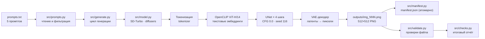

# ARCHITECTURE · Архитектура конвейера диффузии

> Как устроен проект: от текстового промпта до PNG-файла и манифеста,
> плюс веб-интерфейс с живым прогрессом.

## Общая схема

## Конвейер диффузии по шагам

1. **Промпт → токены.** Текст разбивается токенизатором CLIP на 77 токенов
   с паддингом. Промпты на английском — так энкодер работает точнее.
2. **Токены → эмбеддинги.** OpenCLIP ViT-H/14 (энкодер из SD 2.1) переводит
   токены в матрицу текстовых эмбеддингов.
3. **Латентный шум.** Генератор `torch.Generator` с фиксированным seed (116)
   создаёт стартовый гауссов шум 64×64×4 — это «холст» будущего изображения.
4. **Денойзинг UNet × 4.** SD-Turbo — дистиллят по методу ADD: UNet за
   4 шага превращает шум в латент изображения без classifier-free guidance
   (guidance_scale = 0.0), поэтому промпт кодируется один раз.
5. **VAE-декодер.** Латент 64×64×4 разворачивается в изображение 512×512.
6. **Сохранение и фиксация.** PNG записывается в `outputs/`, а в
   `manifest.json` добавляется запись: файл, промпт, seed, время, размер.

## Модули проекта

| Модуль | Ответственность |
|---|---|
| `src/config.py` | вариант 16, модель, seed, шаги, размеры — единая точка правды |
| `src/prompts.py` | чтение `prompts.txt` (одна строка — один промпт, `#` — комментарий) |
| `src/model.py` | ленивая загрузка SD-Turbo, выбор устройства, генерация одного изображения |
| `src/generate.py` | CLI `python -m src.generate --prompts prompts.txt --out outputs/` |
| `src/manifest.py` | манифест прогона, атомарная запись через tmp + `os.replace` |
| `src/validate.py` | проверки: файл существует, не пуст, PNG, 512×512, не однотонный |
| `src/checks.py` | CLI-проверки всего прогона (`python -m src.checks`) |
| `src/server.py` | FastAPI: одностраничный сайт, REST API, SSE-поток генерации |
| `tests/` | pytest: конфиг, промпты, манифест, валидация (18 тестов) |

## Экономия RAM на CPU

SD-Turbo в bf16 занимает ~2.6 ГБ весов. Чтобы генерировать на машине с 4 ГБ
RAM (и вообще без видеокарты), применены несколько приёмов:

- **dtype bfloat16** — веса и вычисления в половинной точности;
- **attention slicing** — матрицы внимания считаются по частям;
- **VAE slicing** — декодер обрабатывает латент срезами, а не целиком;
- **ранняя выгрузка текстового энкодера** — все промпты кодируются
  заранее, энкодер освобождается один раз (~0.6 ГБ), диффузия идёт без него;
- **malloc_trim после каждого изображения** — память возвращается ОС.

Пиковое потребление — около 2.5 ГБ, время генерации одного изображения на
2 ядрах CPU — примерно 17.5–18.3 секунды.

## Веб-интерфейс (строго одна страница)

- **Один файл** `web/index.html`: все стили и скрипты встроены, внешних
  зависимостей нет (только опциональный шрифт Inter с CDN и graceful
  fallback на системные шрифты).
- **Один экран-поток**: шапка → hero → параметры → конвейер → галерея →
  манифест → документация → подвал. Никаких вкладок и отдельных маршрутов.
- **Живой прогресс**: `POST /api/generate` возвращает поток Server-Sent
  Events; страница рисует шаги диффузии, превью из латентов и таймер.

## Три режима генерации в вебе

| Режим | Что делает | Когда доступен |
|---|---|---|
| `replay` | воспроизводит события сохранённого прогона из manifest.json | всегда, даже без torch |
| `real` | локальный инференс SD-Turbo с превью после каждого шага | torch + веса + RAM |
| `cloud` | демо-генерация через pollinations.ai | везде (в т. ч. Render Free) |

Режим `auto` (по умолчанию) выбирает первый доступный: replay → real → cloud.

## SSE-протокол

События потока `POST /api/generate` (тип `data: {json}`):

- `meta` — режим, модель, run_id;
- `stage` — крупная стадия: load / encode / unet / vae / save / cloud;
- `step` — шаг диффузии k/N;
- `preview` — JPEG-превью из промежуточных латентов (base64 data-URL);
- `result` — файл, URL, промпт, seed, время, размер;
- `error` — сообщение об ошибке;
- `end` — завершение потока.
